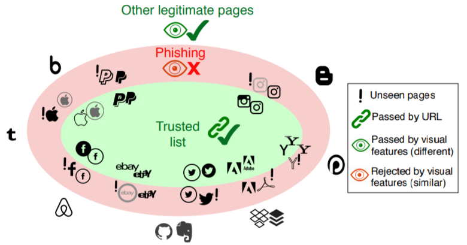

{:refdef: style="text-align: center;"}
{:width="70%"}
{: refdef}

## Abstract

*Phishing websites are still a major threat in today's Internet ecosystem. Despite numerous previous efforts, similarity-based whitelisting methods do not offer sufficient protection for the whitelisted websites - in particular against visually new phishing pages. This paper contributes WhiteNet, a new similarity-based phishing detection framework, based on a triplet Convolutional Neural Network (CNN). WhiteNet learns profiles for websites in order to detect phishing websites by a "visual whitelist" that can generalize to pages with new visual appearances. We furthermore present WhitePhish, the largest dataset to date that facilitates visual phishing detection in an ecologically valid manner. We show that our method outperforms previous visual similarity phishing detection approaches by a large margin while being robust against a range of evasion attacks.*

## WhitePhish Dataset
The dataset has the following screenshots:

* A legitimate whitelist of 155 websites
* Phishing pages targeting the whitelist
* New crawled phishing pages collected in Mar-April 2020
* Benign non-whitelisted websites
* Other test subsets (e.g. different browsers)
